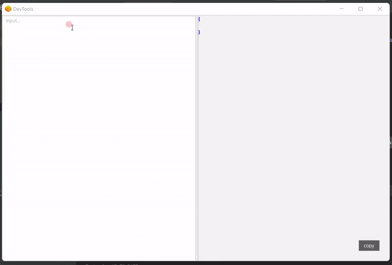
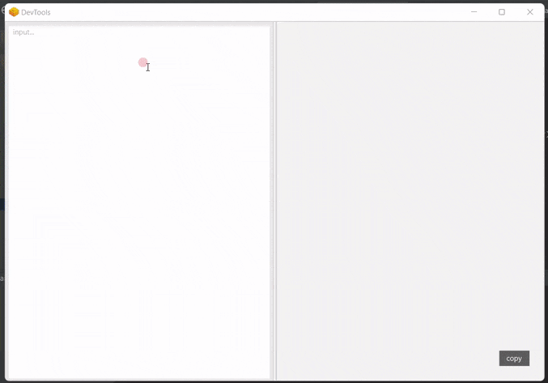

<div align="center">


# ✨ JavaFX JSON Formatter

**A JavaFX desktop application for real-time JSON formatting and validation**

[](https://www.oracle.com/java/)
[](https://gluonhq.com/products/javafx/)
[](https://maven.apache.org/)
[](LICENSE)

</div>

---

## Overview

A lightweight yet powerful desktop utility for developers who work with JSON data. This application provides **real-time
JSON formatting**, **syntax validation**, and **intelligent error highlighting** with an intuitive split-pane interface.

## Features

### **Real-Time JSON Formatting**

- Automatically beautifies JSON as you type
- Customizable indentation for readability
- Color-coded syntax highlighting
    - 🟢 **Green**: Property names
    - 🔵 **Blue**: Braces & numbers
    - 🔴 **Red**: Brackets & arrays
    - 🟤 **Brown**: String values

### **Intelligent Error Detection**

- **Live error highlighting** with animated visual feedback
- **Smart character detection** - identifies the exact problematic character
- **Helpful tooltips** - hover over errors to see detailed problem descriptions
- **Line & column tracking** - know exactly where errors occur
- Supports all common JSON syntax errors:
    - Missing commas
    - Unquoted strings
    - Mismatched brackets/braces
    - Incomplete structures
    - Quote errors

### **Performance Optimized**

- 300ms debounce delay - smooth typing experience
- No lag on large JSON files
- Efficient rendering with proper animation cleanup

### **Developer Friendly**

- One-click copy to clipboard
- Clean, professional UI
- Split-pane layout (input ↔ formatted output)
- Cross-platform support (Windows, macOS, Linux)

---

## Preview

### Standard View

Notice the bold property names that mark possible JSONPath expressions in a JSON structure.

<p align="center">
  
</p>

### Advanced Error Detection

Watch the intelligent error highlighting in real-time:

<p align="center">
  
</p>

---

## Quick Start

### Prerequisites

- **Java 26+** (LibreCA JDK recommended)
- **Maven 3.8+**

### Build from Source

```shell
# Build the project
mvn clean package

# Run the application
mvn javafx:run

# Build JAR only
mvn clean package

# Build JAR + EXE
# ⚠️ Wix is required for EXE generation on Windows. 
# Ensure it's installed and in your PATH.
mvn clean package jpackage:jpackage

# Create shaded JAR
mvn clean shade:shade
```


### Run Pre-built JAR

```bash
# After building
java -jar target/javafx-json-formatter-1.0.0-shaded.jar
```


---

## Authors
[](https://linkedin.com/in/zatribune)

---

<div align="center">

### ⭐ If you find this useful, please consider giving it a star!

**Made with ❤️ for developers who love JavaFX**

</div>
