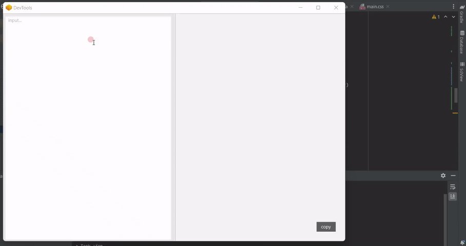

### Overview
A simple JavaFx application to format json data.

### Preview
Notice bold property names that I made intentionally to mark possible JSONPath expressions in a JSON structure.

#### With error detection capabilities:

### Technologies
- Java
- JavaFX
- gradle

## Authors

